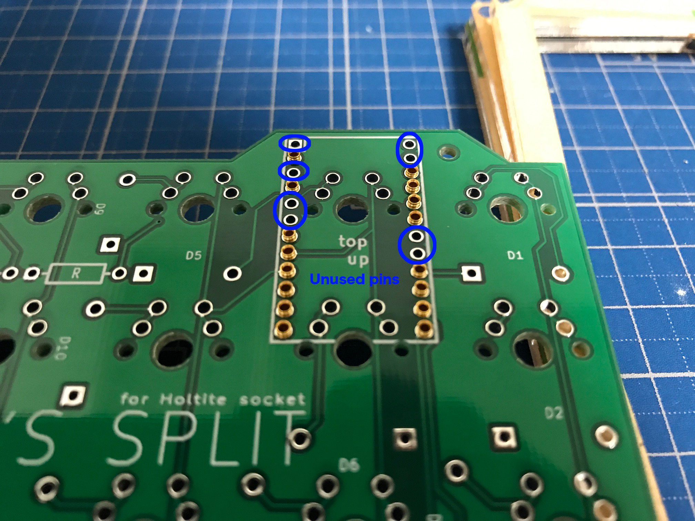
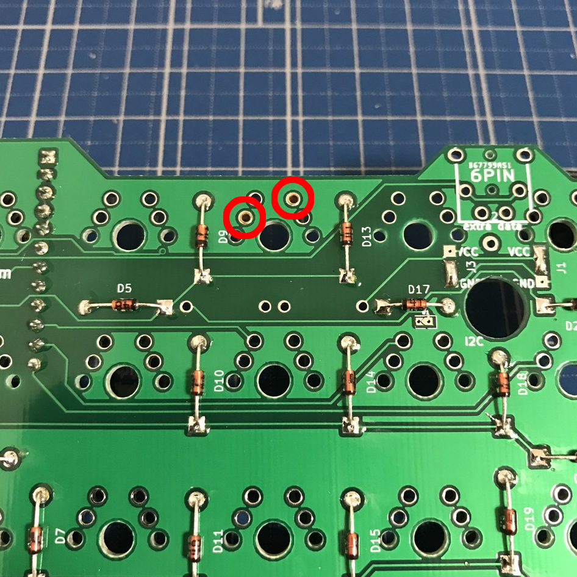

# lets-split-pcb-hs-cherry

Let's Split PCB for holtite socket only Cherry MX switches.

Based on [climbalima/let-s-Split-v2](https://github.com/climbalima/let-s-Split-v2).

## Overview

By crimping the socket to the through hole, it is possible to install without having to solder the axis of the switch and Pro Micro.

Cherry MX switch and several clone switches are available.

ALPS/Matias switch is ***NOT AVAILABLE***.

## Supported socket

- [TE CONNECTIVITY 8134-HC-8P2](http://www.te.com/jpn-ja/product-7-1437514-0.html)
- [TE CONNECTIVITY 8134-HC-8P3](http://www.te.com/jpn-ja/product-7-1437514-1.html)

## How to order PCB

There is a [releases page](https://github.com/haru-ake/lets-split-pcb-hs-cherry/releases) that zipped the Gerber file. You can use it to order to your preferred merchant.

I ordered it for [PCBGOGO](https://www.pcbgogo.jp/) and confirmed that I could manufacture it.

## How to crimp the socket

See youtube video.

## Points to note when crimping

***IMPORTANT!*** Since Pro Micro will be inserted from the bottom of the PCB, the switch will be inserted from the top of the PCB, so be careful of the orientation of the PCB when crimping the socket.

### Pro Micro

You can crimp the socket only to the through hole of the pin to be used. You can ***NOT*** crimp the socket into the through hole of the unused pin.

It is not possible to crimp the socket to the through hole where the socket is not stuck in the picture.

### Switches

Be careful not to mistake the position of the through hole.

